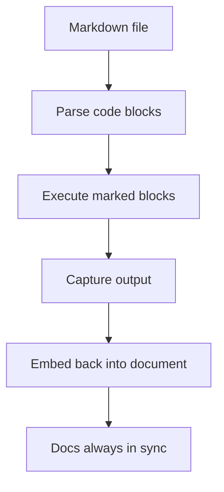

# literate-docs

Code and documentation live in separate worlds. Docs rot the moment they're written — examples go stale, outputs change, and nobody notices until a user reports it.

**literate-docs** keeps them together. Write executable code blocks in your markdown, run the tool, and get your docs back with live output embedded. Run it again and the output updates. Your documentation stays in sync with reality.

## How It Looks

**Input:**

````markdown
```sh exec
echo "Result: $((2 + 2))"
```
````

**After running `literate-docs`:**

````markdown
```sh exec
echo "Result: $((2 + 2))"
```

```output
Result: 4
```
````

The code executes, the output is captured and embedded. Next time you run it, the output refreshes automatically.

## How It Works



## Quick Start

```bash
cargo install --path .
literate-docs your-file.md
```

Or without installing:

```bash
cargo run -- your-file.md
```

Add `--write` (`-w`) to update the file in place, or `--interactive` (`-i`) for a live TUI view with streaming output.

<!-- sh exec: cargo run -- --help -->

```output
Usage: literate-docs [OPTIONS] [FILE]

Literate programming tool that executes code blocks in markdown

Arguments:
  [FILE]    Input markdown file (reads from stdin if omitted)

Options:
  -i, --interactive    Interactive mode with streaming output
  -w, --write          Write output back to the input file in place
  -h, --help           Print help
  -V, --version        Print version
```

## Features

* **Execute code blocks** — Any block marked with `exec` runs and its output is embedded
* **Hidden code blocks** — Use `<!-- sh exec: ... -->` to hide source in rendered markdown while still executing
* **Idempotent** — Running twice produces the same result. Existing output blocks are detected and replaced
* **Format preservation** — Output matches the existing style (code block or comment)
* **Interactive TUI** — Live scrollable document with streaming output
* **Graceful fallback** — Unknown languages pass through unchanged

## Supported Languages

| Language | Identifiers | Tools (priority order) |
|----------|-------------|------------------------|
| Shell | `sh`, `bash`, `shell` | `/bin/sh` |
| Python | `python`, `python3` | `python3` |
| JavaScript | `js`, `javascript`, `node` | `node`, `bun` |
| TypeScript | `ts`, `typescript` | `ts-node`, `tsx`, `bun`, `node --experimental-strip-types` |
| Ruby | `ruby` | `ruby` |
| Perl | `perl` | `perl` |
| PHP | `php` | `php` |
| Go | `go` | `go run` |
| Rust | `rust` | `rustc` |

## License

MIT
