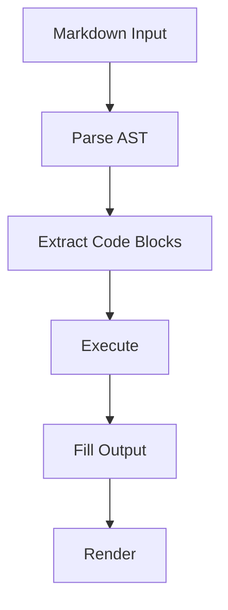

# Literate Docs TUI Demo

This document showcases the interactive TUI mode with live streaming output.

## Quick Shell Commands

Simple commands that complete fast:

```sh exec
echo "Hello from literate-docs!"
```

```sh exec
date
```

```sh exec
whoami
```

## Python Output

```python exec
import sys
print(f"Python version: {sys.version.split()[0]}")
print(f"Platform: {sys.platform}")
```

## Node.js Example

```js exec
const os = require('os');
console.log(`Hostname: ${os.hostname()}`);
console.log(`CPUs: ${os.cpus().length}`);
console.log(`Memory: ${Math.round(os.totalmem() / 1024 / 1024 / 1024)}GB`);
```

## Slow Rust Compilation

This will take a few seconds to compile and run:

```rust exec
fn fibonacci(n: u64) -> u64 {
    match n {
        0 => 0,
        1 => 1,
        _ => fibonacci(n - 1) + fibonacci(n - 2),
    }
}

fn main() {
    println!("Computing fibonacci(40)...");
    let start = std::time::Instant::now();
    let result = fibonacci(40);
    let elapsed = start.elapsed();
    println!("fibonacci(40) = {}", result);
    println!("Computed in {:?}", elapsed);
}
```

## Simulated Slow Shell Task

```sh exec
echo "Starting slow task..."
sleep 2
echo "Step 1 of 3 complete"
sleep 2
echo "Step 2 of 3 complete"
sleep 1
echo "Step 3 of 3 complete"
echo "All done!"
```

## Another Python Block

```python exec
import time

print("Processing data...")
time.sleep(1)
print("Analyzing results...")
time.sleep(1)

results = [i**2 for i in range(10)]
print(f"Squares: {results}")
print(f"Sum: {sum(results)}")
```

## Non-Executable Code (should render as plain code block)



```json
{
  "name": "literate-docs",
  "version": "0.1.0",
  "description": "A demo config"
}
```

## More Shell Commands

```sh exec
ls -la /tmp | head -5
```

```sh exec
echo "Current directory: $(pwd)"
echo "Files in current dir: $(ls | wc -l)"
```

## Summary

This document contains:
- Fast shell commands
- Python and Node.js blocks
- Slow Rust compilation (fibonacci)
- Simulated slow tasks with sleep
- Non-executable code blocks (mermaid, json)
- Multiple output boxes to scroll through
