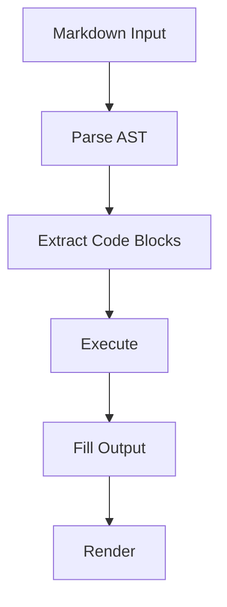

# Literate Docs TUI Demo

This document showcases the interactive TUI mode with live streaming output.

## Quick Shell Commands

Simple commands that complete fast:

```sh
echo "Hello from literate-docs!"
```

```output
Hello from literate-docs!
```

```sh
date
```

```output
Fri Apr  3 05:59:05 PM EEST 2026
```

```sh
whoami
```

```output
hela
```

## Python Output

```python
import sys
print(f"Python version: {sys.version.split()[0]}")
print(f"Platform: {sys.platform}")
```

```output
Python version: 3.14.3
Platform: linux
```

## Node.js Example

```js
const os = require('os');
console.log(`Hostname: ${os.hostname()}`);
console.log(`CPUs: ${os.cpus().length}`);
console.log(`Memory: ${Math.round(os.totalmem() / 1024 / 1024 / 1024)}GB`);
```

```output
Hostname: bever
CPUs: 4
Memory: 8GB
```

## Slow Rust Compilation

This will take a few seconds to compile and run:

```rust
fn fibonacci(n: u64) -> u64 {
    match n {
        0 => 0,
        1 => 1,
        _ => fibonacci(n - 1) + fibonacci(n - 2),
    }
}

fn main() {
    println!("Computing fibonacci(40)...");
    let start = std::time::Instant::now();
    let result = fibonacci(40);
    let elapsed = start.elapsed();
    println!("fibonacci(40) = {}", result);
    println!("Computed in {:?}", elapsed);
}
```

```output
Computing fibonacci(40)...
fibonacci(40) = 102334155
Computed in 1.469489277s
```

## Simulated Slow Shell Task

```sh
echo "Starting slow task..."
sleep 2
echo "Step 1 of 3 complete"
sleep 2
echo "Step 69 of 3 complete"
sleep 1
echo "Step 3 of 3 complete"
echo "All done!"
```

This is really slow:

```output
Starting slow task...
Step 1 of 3 complete
Step 2 of 3 complete
Step 3 of 3 complete
All done!
```

## Another Python Block

```python
import time

print("Processing data...")
time.sleep(1)
print("Analyzing results...")
time.sleep(1)

results = [i**2 for i in range(10)]
print(f"Squares: {results}")
print(f"Sum: {sum(results)}")
```

```output
Processing data...
Analyzing results...
Squares: [0, 1, 4, 9, 16, 25, 36, 49, 64, 81]
Sum: 285
```

## Non-Executable Code (should render as plain code block)



```json
{
  "name": "literate-docs",
  "version": "0.1.0",
  "description": "A demo config"
}
```

## More Shell Commands

```sh
ls -la /tmp | head -5
```

```output
total 3016
drwxrwxrwt 14 root root     440 Apr  3 17:59 .
drwxr-xr-x  1 root root     142 Oct 28 01:05 ..
-rw-r--r--  1 hela hela       0 Apr  3 11:53 .3ae7ecddb6ef9dff-00000000.hm
-rwxr-xr-x  1 hela hela 3063632 Apr  3 11:23 debug_ast
```

```sh
echo "Current directory: $(pwd)"
echo "Files in current dir: $(ls | wc -l)"
```

```output
Current directory: /home/hela/Projects/literate-docs
Files in current dir: 7
```

## Summary

This document contains:

* Fast shell commands
* Python and Node.js blocks
* Slow Rust compilation (fibonacci)
* Simulated slow tasks with sleep
* Non-executable code blocks (mermaid, json)
* Multiple output boxes to scroll through
